<p align="center">
  
</p>

<h1 align="center">Telepush</h1>
<h3 align="center">Send Telegram push notifications easily via HTTP</h3>

<p align="center">

<a href="mailto:ferdinand@muetsch.io?subject=Thanks for creating Telepush" target="_blank"></a>
<a href="https://wakapi.dev" target="_blank"></a>
<a href="https://sonarcloud.io/dashboard?id=muety_telegram-middleman-bot"></a>
</p>

---

## 📄 Description

A simple [Telegram Bot](https://t.me/MiddleManBot) to translate `POST` requests with JSON payload into Telegram push
messages. Similar [Gotify](https://gotify.net/) and [ntfy.sh](https://ntfy.sh/), except without an extra app. Useful for
server monitoring, alerting, and anything else.

## ⌨️ How to use?

### Step 1: Get a token

Open Telegram, start a chat with the [TelepushBot](https://t.me/MiddleManBot) (or your own bot, respectively) and
type `/start` to obtain a recipient token.

### Step 2: Send messages

Messages are sent via `POST` to **`https://telepush.dev/api/[[inlets/<inlet_name>]|messages]/<recipient>`**.

```bash
curl -XPOST \
     -H 'Content-Type: application/json' \
     -d '{ "text": "*Hello World!* (yes, this is Markdown)" }' \
     'https://telepush.dev/api/messages/<recipient>'
```

When hosting your own instance, replace the URL respectively.

### ✉️ Message options

| **Key**                             | **Type**         | **Description**                                             |
|-------------------------------------|------------------|-------------------------------------------------------------|
| **`text`***                         | string           | Actual message in plain text or Markdown format             |
| **`origin`**                        | string           | What will be shown as the sender of your message            |
| **`type`**                          | [`TEXT`, `FILE`] | Message type, i.e. to send text or a file (default: `TEXT`) |
| **`file`****                        | base64           | Base64-encoded file content                                 |
| **`filename`****                    | string           | Name of the file to send                                    |
| **`options`**                       | object           | Additional options to pass                                  |
| **`options.disable_link_previews`** | bool             | Whether to show previews of links in the chat               |

`*` = required for `type: TEXT`, `**` = required for `type: FILE`

More details to be found [here](/inlets).

## 🏃‍♀️ How to run?

### ☁️ Option 1: [telepush.dev](https://telepush.dev)

Simply use the official hosted instance. Rate-limited to 240 requests per recipient per day.

### 🌐 Option 2: Self-hosted

When hosting your own Telepush instance, you need to create a new bot with [@BotFather](https://t.me/BotFather) first.
As a result, you will get a token that you then pass to Telepush when starting the server (see below).

#### 🐳 Option 2.1: With Docker

```bash
$ docker volume create telepush_data
$ docker run -d \
    -p 8080:8080 \
    -v telepush_data:/srv/data \
    --name telepush \
    ghcr.io/muety/telepush \
    -mode webhook \
    -token <YOUR_BOTFATHER_TOKEN>
```

#### 🛠 Option 2.2: Compile from source

```bash
# Install
$ go install github.com/muety/telepush@latest

# Run (webhook mode)
$ ./telepush -token <YOUR_BOTFATHER_TOKEN> -mode webhook
```

#### ↔️ Webhook vs. long-polling

You can either run the bot in long-polling- or webhook mode (`-mode [webhook|poll]`). For production use the latter
option is recommended for [various reasons](https://core.telegram.org/bots/webhooks). However, you'll need a server with
a static IP and a TLS certificate.

More details about webhook setup can be found in [__Marvin's Marvellous Guide to All Things Webhook__](https://core.telegram.org/bots/webhooks).

#### 🔓 HTTPS
In webhook mode, Telegram requires your [updates endpoint](https://core.telegram.org/bots/api#getting-updates) to use HTTPS. To enable such, either run Telepush **behind a reverse proxy** (like [Caddy](https://caddyserver.com/docs/quick-starts/reverse-proxy)), that terminates TLS.

Or, let Telepush itself handle TLS. You'll need a **certificate** for this, so either get one from [Let's Encrypt](https://letsencrypt.org/) or [create a self-signed one](https://www.linode.com/docs/guides/create-a-self-signed-tls-certificate/), then use `-useHttps` in combination with `-certPath` and `-keyPath` pointed to your certificate and private key files respectively.

For self-signed certificates, you'll need to pass your public key to Telegram's `setWebhook` method in addition, see [these instructions](https://core.telegram.org/bots/webhooks#how-do-i-set-a-webhook-for-either-type).

## 🔧 Configuration options

* `-address` (`string`) – Network address (IPv4) to bind to. Defaults to `127.0.0.1`.
* `-address6` (`string`) – Network address (IPv6) to bind to. Defaults to `::1`.
* `-disableIPv6` (`bool`) – Whether to disable listening on both IPv4 and IPv6 interfaces. Defaults to `false`.
* `-port` (`int`) – TCP port to listen on. Defaults to `8080`.
* `-proxy` (`string`) – Proxy connection string to be used for long-polling mode. Defaults to none.
* `-urlSecret` (`string`) – Random suffix to append to your updates route called by Telegram's servers to prevent spam. Defaults to none.
* `-useHttps` (`bool`) – Whether to use HTTPS. Defaults to `false`.
* `-certPath` (`string`) – Path of your SSL certificate when using webhook mode with `useHttp`. Default to none.
* `-keyPath` (`string`) – Path of your private SSL key when using webhook mode with `useHttp`. Default to none.
* `-dataDir` (`string`) – File system location where to store persistent data. Defaults to `.`.
* `-blacklist` (`string`) – Path to a line-separated blacklist file containing user IDs (send `/help` to get your id). Defaults to `blacklist.txt`.
* `-whitelist` (`string`) – Path to a line-separated whitelist file containing user IDs (send `/help` to get your id). Defaults to `whitelist.txt`.
* `-rateLimit` (`int`) – Maximum number of messages to be delivered to each recipient per hour. Defaults to `100`.
* `-metrics` (`bool`) – Whether to expose [Prometheus](https://prometheus.io) metrics under `/metrics`. Defaults
  to `false`.

When using the Docker image, you can alternatively set most of the above config options via **environment variables** (passed to `docker run` using `-e`), e.g. `APP_USE_HTTPS=true`, `APP_CERT_PATH=/etc/telepush.crt`, etc. For details, see [`entrypoint.sh`](docker/entrypoint.sh).

### Whitelist vs. Blacklist
(aka. allow-list vs. block-list)



## 📥 Inlets

Inlets provide a mechanism to pre-process incoming data that comes in a format different from what is normally expected
by the bot.

This is especially useful if data is sent by external, third-party applications which you cannot modify.

For instance, you might want to deliver alerts
from [Prometheus' Alertmanager](https://prometheus.io/docs/alerting/alertmanager/) as Telegram notifications. However,
Alertmanager's [webhook requests](https://prometheus.io/docs/alerting/configuration/#webhook_config) look much different
from Telepush's default input format. To still make them fit, you can write an [Inlet](/inlets) to massage the data
accordingly.

To directly address an inlet, request `https://telepush.dev/api/inlets/<inlet_name>`. Note that `/api/inlets/default` is
equivalent to `/api/messages`.

Following inlets are currently available:

| Name           | Description                                                                                                                                                                    | Status |
|----------------|--------------------------------------------------------------------------------------------------------------------------------------------------------------------------------|--------|
| `default`      | Simply passes the request through without any changes                                                                                                                          | ✅      |
| `alertmanager` | Consumes [Alertmanager webhook requests](https://prometheus.io/docs/alerting/configuration/#webhook_config)                                                                    | ✅      |
| `grafana`      | Consumes [Grafana webhook requests](https://grafana.com/docs/grafana/latest/alerting/contact-points/notifiers/webhook-notifier/)                                               | ✅      |
| `webmentionio` | Accepts [Webmention.io](https://webmention.io/) webhook requests to notify about a new Webmention of one of your articles                                                      | ✅      |
| `bitbucket`    | Accepts [Bitbucket webhook requests](https://confluence.atlassian.com/bitbucket/tutorial-create-and-trigger-a-webhook-747606432.html) to notify about a pipeline status change | ⏳      |

Further documentation about the individual inlets is available [here](/inlets).

## 📊 Metrics

Fundamental [Prometheus](https://prometheus) metrics are exposed under `/metrics`, if the `-metrics` flag gets passed.
They include:

* `telepush_messages_total{origin="string", type="string"}`
* `telepush_requests_total{success="string"}`

## 🐞 Troubleshooting
### Error: `panic: template: pattern matches no files: *.tpl.html`
When running Telepush as a single executable, you **must not use dev mode** unless Telepush's source code is located inside the same directory. Make sure to not pass `-env dev` in this case.

## 📓 License

MIT @ [Ferdinand Mütsch](https://muetsch.io)
